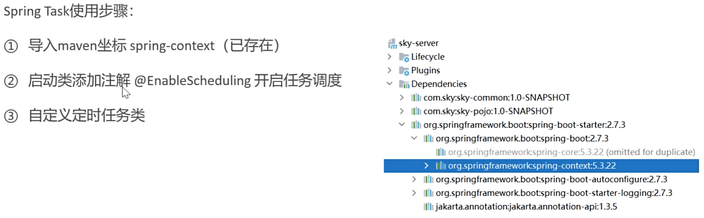

苍穹外卖项目实战笔记

# Day01

该项目用到了以下的技术：


该项目因此需要两个前端和一个后端：


代码结构为：


其中，pojo子项目中的分类为：


## Nginx

nginx可以作为一个反向代理，对前端发送的动态请求转发到后端服务器。具有以下优点：

> 提高访问速度；
>
> 实现负载均衡；
>

### 反向代理


### 负载均衡

负载均衡的实现是可能基于以下策略的：


## 完善登录功能

将密码的部分增加了一个md5加密的过程：

> ```
> password = DigestUtils.md5DigestAsHex(password.getBytes());
> ```

## 接口设计


所以在yapi中加入了管理端和验证端的接口信息。

## Swagger-后端接口测试技术


### API常用注解


通过接口注解，在接口文档就自动生成了对应的注解内容。

# Day02

## 员工管理

### 对象属性拷贝

经常用于DTO类型的数据属性传给原类型的过程。

```java
// 实用Spring带的对象属性拷贝
BeanUtils.copyProperties(employeeDTO, employee);
```

使用该方法将对象的属性方便地全部拷贝过去，但要求属性名得是一致的。

### 利用JWT令牌获得当前登录员工ID

JWT的过程如下图所示：


为了获得当前登陆的员工ID，就需要利用JWT令牌，从token中将ID解析出来。

### ThreadLocal技术

解析很好解析，但如何将解析出来的ID传递给其他方法用呢？这就涉及到了**ThreadLocal**。而可以使用的原因是：**客户端的每次请求都是一个单独的线程**。


### PageHelper一个分页查询小插件

可以通过PageHelper来辅助将结果分页查询：

```java
PageHelper.startPage(employeePageQueryDTO.getPage(), employeePageQueryDTO.getPageSize());
```

### JWT令牌的有效期

因为在员工登陆时设置了令牌，同时在server的applicationa文件中对令牌设置了有效期。

```yml
sky:
  jwt:

    admin-secret-key: itcast

    admin-ttl: 7200000

    admin-token-name: token
```

因此，如果长时间不操作，就得重新登录获取令牌。Swagger测试代码时在“**全局参数设置**”中替换为新的令牌。

### 处理日期格式

两种方式对日期处理，前者要一个个设置，后者可以一劳永逸。


#### 方式一

```java
@JsonFormat(pattern = "yyyy-MM-dd HH:mm:ss")
private LocalDateTime createTime;

@JsonFormat(pattern = "yyyy-MM-dd HH:mm:ss")
private LocalDateTime updateTime;
```

#### 方式二

```java
/*
扩展SpringMVC框架的消息转换器
 */
protected void extendMessageConverters(List<HttpMessageConverter<?>> converters){
    // 创建一个消息转换器对象
    MappingJackson2HttpMessageConverter converter = new MappingJackson2HttpMessageConverter();
    // 为消息转换器设置一个对象转换器,将java对象序列化为json数据,用于序列化和反序列化
    converter.setObjectMapper(new JacksonObjectMapper());
    // 将消息转换器添加到容器中
    converters.add(0,converter);
}
```

### 创建对象的Builder

如果类上有注解**@Builder**，则可以使用构造器构造对象，如下代码：

```java
//使用builder器创建对象
Employee.builder().status(status).id(id).build();
```

# Day03

## 公共字段自动填充

**公共字段**有以下几种，每次操作一般都需要对这些字段赋值的，就会产生很多冗余代码，后期维护不易变更。


### 实现思路


这样的话，只需要在想要操作的方法上加上这个注解就可以了。

## 新增菜品

一个新增菜品的功能包含三个接口，而查询菜品是已有的接口。

### 文件上传

这部分需要用到阿里云的OSS服务，首先要在配置文件中进行如下配置，在dev/普通环境中使用不同的配置文件：


### 菜品口味接口

需要设计一个DishFlavorMapper类，在新增菜品时对菜品的口味进行操作。

## 菜品分页查询


## 删除菜品

只用设计一个批量删除的接口，单个删除就是批量删除的特殊形式。但是如果用for循环包围，一次次执行单个删除操作，会产生较多次数的与数据库交互，这对性能的影响比较严重，可以通过优化SQL语句，一次交互达成多个效果：

```java
//        // 删除菜品表中的菜品数据
//        for(Long id : ids){
//            dishMapper.deleteById(id);
//            // 删除菜品关联的口味数据
//            dishFlavorMapper.deleteByDishId(id);
//        }
        dishMapper.deleteByIds(ids);
        dishFlavorMapper.deleteByDishIds(ids);
```

## 修改菜品

修改时，前端界面需要**回显菜品**的信息，所以这部分需要两个接口：根据ID查询菜品、修改菜品。

### 根据ID查询菜品

主要是在实现类中按照如下方法进行。

```java
public DishVO getByIdWithFlavor(Long id) {
    //根据id查询菜品
    Dish dish = dishMapper.getById(id);

    //根据ID查询口味数据
    List<DishFlavor> flavors = dishFlavorMapper.getByDishId(id);

    //查询到的数据封装VO
    DishVO dishVO = new DishVO();
    BeanUtils.copyProperties(dish,dishVO);
    //再额外封装一下口味数据
    dishVO.setFlavors(flavors);

    return dishVO;
}
```

### 修改菜品

修改菜品的逻辑为：

```java
public void updateWithFlavor(DishDTO dishDTO) {
    Dish dish = new Dish();
    BeanUtils.copyProperties(dishDTO, dish);

    // 修改菜品表
    dishMapper.update(dish);
    // 修改关联的口味表，比较复杂，为了简单起见，可以先全部删除再新增。
    dishFlavorMapper.deleteByDishId(dishDTO.getId());
    //重新插入口味数据
    List<DishFlavor> flavors = dishDTO.getFlavors();
    if(flavors != null && flavors.size() > 0){  //口味是可能为空的
        //先为这些口味表插入dishId
        for (DishFlavor flavor : flavors) {
            flavor.setDishId(dishDTO.getId());
        }
        dishFlavorMapper.insertBatch(flavors);
    }
}
```

# Day04

## 实战项目

# Day05

## Redis-另一种数据库


### 入门

解压压缩包后的redis即可使用，并可通过图形化界面redis manager使用。

### Redis中的数据类型


### 常用命令

#### 字符串操作


#### 哈希数据操作


#### 列表操作命令


#### 集合操作命令


#### 有序集合操作命令


#### 通用命令


## 在java中使用redis

本项目通过Spring Data Redis使用Redis，步骤为：


redis会默认生成16个DB数据库，默认使用0号数据库，当然也可以在yml里更改。

## 店铺营业状态设置

营业状态是一个布尔值，不必要另创建一张MySQL表，因此可以使用Redis存储状态。

# Day06微信小程序开发

## HttpClient

以POST请求为例，使用HttpClient：

```java
//POST请求
@Test
public void testPost() throws Exception {

    // 创建Httpclient对象
    CloseableHttpClient httpClient = HttpClients.createDefault();

    // 创建请求对象
    HttpPost httpPost = new HttpPost("http://localhost:8080/admin/employee/login");
    JSONObject jsonObject = new JSONObject();
    jsonObject.put("username","admin");
    jsonObject.put("password","123456");
    StringEntity entity = new StringEntity(jsonObject.toString());
    //指定请求编码方式
    entity.setContentEncoding("utf-8");
    //数据格式
    entity.setContentType("application/json");
    httpPost.setEntity(entity);

    //发送请求
    CloseableHttpResponse response = httpClient.execute(httpPost);

    //解析返回结果
    //获取返回状态码
    int statusCode = response.getStatusLine().getStatusCode();
    System.out.println("返回的状态码为"+statusCode);
    //获取返回内容
    HttpEntity entity1 = response.getEntity();
    String body = EntityUtils.toString(entity1);
    System.out.println("返回的数据体为"+body);
    //关闭资源
    response.close();
    httpClient.close();
}
```

## 小程序开发

### 前期准备

在微信小程序网页上注册，报备，然后下载小程序的开发工具。

### 目录结构


#### 页面文件


开发小程序不是重点，所以直接导入已有的文件就可以。

## 微信登录接口开发

为了完成微信登录功能的接口开发，首先需要在配置文件中添加新的配置：


## 商品浏览功能添加


# Day07

查询数据库太慢了，所以需要用到Redis缓存，这样用户查询的时候速度就大大加快了。


Redis是**基于内存**的，查询就会快很多。


## 缓存菜品

### 缓存菜品数据

只需要在User的DishController中将list的逻辑修改为：

```java
@GetMapping("/list")
@ApiOperation("根据分类id查询菜品")
public Result<List<DishVO>> list(Long categoryId) {
    //构造Redis中的key
    String key = "dish_" + categoryId;

    // 查询Redis中是否存在菜品数据
    List<DishVO> list = (List<DishVO>) redisTemplate.opsForValue().get(key);
    if(list != null && list.size() > 0){
        // 若存在，直接返回，无需查询
        return Result.success(list);
    }

    //不存在，去查询，并放入redis中
    Dish dish = new Dish();
    dish.setCategoryId(categoryId);
    dish.setStatus(StatusConstant.ENABLE);//查询起售中的菜品

    list = dishService.listWithFlavor(dish);
    redisTemplate.opsForValue().set(key, list);

    return Result.success(list);
}
```

### 清理缓存数据

不清理缓存的话，数据库中数据变化时，会导致缓存中的数据和数据库中**不一致**，就需要清理缓存数据的操作。

只有商家的操作会导致数据库信息改变，因此只需要在admin的DishController中修改，首先增加私有方法用于清理redis缓存：

```java
private void cleanCache(String pattern){
        redisTemplate.delete(redisTemplate.keys(pattern));
}

```

之后只需要在商家对**数据库有影响的操作**上增加清理缓存的代码，如：

```java
@PostMapping
@ApiOperation("新增菜品")
public Result save(@RequestBody DishDTO dishDTO){
    log.info("新增菜品:{}",dishDTO);
    dishService.saveWithFlavor(dishDTO);

    //清理缓存数据,受影响的分类才需要清理
    String key = "dish_" + dishDTO.getCategoryId();
    cleanCache(key);
    return Result.success();
}
```

## Spring Cache

又是一个新的框架，并且可以替换不同的缓存实现。


常用的注解为：


## 缓存套餐

缓存套餐具体的实现思路可以梳理为以下：


## 添加购物车

```JAVA
public void addShoppingCart(ShoppingCartDTO shoppingCartDTO) {
    //判断当前加入到购物车中的商品是否已经存在
    ShoppingCart shoppingCart = new ShoppingCart();
    BeanUtils.copyProperties(shoppingCartDTO,shoppingCart);
    //获取当前用户
    Long userId = BaseContext.getCurrentId();
    shoppingCart.setUserId(userId);

    List<ShoppingCart> list = shoppingCartMapper.list(shoppingCart);

    //若存在，数量加一
    if(list!=null && list.size() > 0){
        ShoppingCart cart = list.get(0);
        cart.setNumber(cart.getNumber()+1);
        shoppingCartMapper.updateNumberById(cart);
    }else {
        //若不存在，插入一条购物车数据，但还需要分辨添加的是菜品还是套餐
        Long dishId = shoppingCartDTO.getDishId();
        if(dishId != null){
            //添加的是菜品
            Dish dish = dishMapper.getById(dishId);
            shoppingCart.setName(dish.getName());
            shoppingCart.setImage(dish.getImage());
            shoppingCart.setAmount(dish.getPrice());
        }else{
            //添加的是套餐
            Long setmealId = shoppingCartDTO.getSetmealId();

            Setmeal setmeal = setmealMapper.getById(setmealId);
            shoppingCart.setName(setmeal.getName());
            shoppingCart.setImage(setmeal.getImage());
            shoppingCart.setAmount(setmeal.getPrice());
        }
        shoppingCart.setNumber(1);
        shoppingCart.setCreateTime(LocalDateTime.now());
        shoppingCartMapper.insert(shoppingCart);
    }
}
```

## 查看购物车


## 清空购物车


# Day08

## 导入地址簿代码

没什么好说的，简单的功能，直接复制文件即可。


## 用户下单

核心逻辑就是向订单表插入这条订单数据，并向订单明细表插入n条数据，清空所选的购物车后返回封装VO类即可。

```java
@Override
@Transactional
public OrderSubmitVO submitOrder(OrdersSubmitDTO ordersSubmitDTO) {

    //处理各种业务异常（地址簿为空、购物车为空）
    //地址簿
    AddressBook addressBook = addressBookMapper.getById(ordersSubmitDTO.getAddressBookId());
    if (addressBook == null) {
        //抛出异常
        throw new AddressBookBusinessException(MessageConstant.ADDRESS_BOOK_IS_NULL);
    }
    //购物车
    ShoppingCart shoppingCart = new ShoppingCart();
    shoppingCart.setUserId(BaseContext.getCurrentId());
    List<ShoppingCart> shoppingCartList = shoppingCartMapper.list(shoppingCart);
    if(shoppingCartList == null || shoppingCartList.size() == 0) {
        //抛出异常
        throw new ShoppingCartBusinessException(MessageConstant.SHOPPING_CART_IS_NULL);
    }

    //向订单表插入一条数据
    Orders orders = new Orders();
    BeanUtils.copyProperties(ordersSubmitDTO, orders);
    orders.setOrderTime(LocalDateTime.now());
    orders.setPayStatus(Orders.UN_PAID);
    orders.setStatus(Orders.PENDING_PAYMENT);
    orders.setNumber(String.valueOf(System.currentTimeMillis()));
    orders.setPhone(addressBook.getPhone());
    orders.setConsignee(addressBook.getConsignee());
    orders.setUserId(BaseContext.getCurrentId());

    orderMapper.insert(orders);

    //向订单明细表插入n条数据
    List<OrderDetail> orderDetailList = new ArrayList<>();
    for(ShoppingCart cart : shoppingCartList) {
        OrderDetail orderDetail = new OrderDetail();
        BeanUtils.copyProperties(cart, orderDetail);
        orderDetail.setOrderId(orders.getId());
        orderDetailList.add(orderDetail);
    }
    orderDetailMapper.insertBatch(orderDetailList);

    //清空当前用户的购物车数据
    shoppingCartMapper.deleteByUserId(BaseContext.getCurrentId());

    //封装VO返回结果
    OrderSubmitVO orderSubmitVO = OrderSubmitVO.builder()
            .id(orders.getId())
            .orderTime(orders.getOrderTime())
            .orderNumber(orders.getNumber())
            .orderAmount(orders.getAmount())
            .build();

    return orderSubmitVO;
}
```


## 订单支付

开通支付功能需要资质才行，但代码和逻辑可以预先学习，并使用黑马提供的商户号即可。本节的重点还是理解微信支付的流程。

### 微信支付介绍

微信支付的时序流程为：


为了安全性，还需要从**微信商户平台**下载两种文件：平台证书文件和商户文件。相关的配置为：


其他的功能直接导入文件即可。

## cpolar-获取临时域名

> cpolar极点云: 公开一个本地Web站点至公网。
>
> 只需一行命令，就可以将内网站点发布至公网，方便给客户演示。
>
> 高效调试微信公众号、小程序、对接支付宝网关等云端服务，提高您的编程效率。

这是个内网穿透工具，已经跟着课程配置好，需要使用的时候只需要在cpolar目录中开启cmd命令行并运行：

> cpolar.exe http 8080

就可以在对应的url中像访问本地一样访问了。

# Day09

## 实战项目

### Stream API和Lambda表达式

```java
// 将订单详情对象转换为购物车对象
List<ShoppingCart> shoppingCartList = orderDetailList.stream().map(x -> {
    ShoppingCart shoppingCart = new ShoppingCart();

    // 将原订单详情里面的菜品信息重新复制到购物车对象中
    BeanUtils.copyProperties(x, shoppingCart, "id");
    shoppingCart.setUserId(userId);
    shoppingCart.setCreateTime(LocalDateTime.now());

    return shoppingCart;
}).collect(Collectors.toList());
```

这是因为代码使用了Java 8中的Stream API和Lambda表达式，这些特性提供了一种更为函数式的编程风格，其中的`map`操作会对流中的**每个元素**应用指定的函数。

具体来说，这段代码使用了`map`方法来对`orderDetailList`中的每个元素（`OrderDetail`对象）进行映射。Lambda表达式 `x -> {...}` 中的代码块会被应用到每个`OrderDetail`对象上，这样就不需要显式的`for`循环。在Lambda表达式中，通过`BeanUtils.copyProperties`等操作来处理每个`OrderDetail`对象并生成对应的`ShoppingCart`对象。

### 百度地图距离判定API

在application-dev中配置自己的百度地图ak，后在`OrderServiceImpl`文件中添加路径判别方法`checkOutOfRange`，并在提交订单的方法`submitOrder`中添加该判别方法。


# Day10-任务调度与双向通信

## Spring Task-任务调度工具


### 任务触发时间


不过无需自己设计，可以在cron表达式在线生成网站中生成：https://cron.qqe2.com。

### 使用步骤



主要的任务量还是在于自定义定时任务类的编写上。

## 订单状态定时处理

### 待支付过久

```java
//超时订单处理方法
@Scheduled(cron = "0 * * * * ?")//每分钟触发一次
public void processTimeoutOrder() {
    log.info("定时处理超时订单:{}", LocalDateTime.now());

    //查询超时的订单
    LocalDateTime localDateTime = LocalDateTime.now().minusMinutes(15);
    List<Orders> ordersList = orderMapper.getByStatusAndOrderTimeLT(Orders.PENDING_PAYMENT, localDateTime);

    //处理超时订单
    if(ordersList != null && ordersList.size() > 0) {
        for(Orders orders : ordersList) {
            orders.setStatus(Orders.CANCELLED);
            orders.setCancelTime(LocalDateTime.now());
            orders.setCancelReason("订单超时，自动取消");
            orderMapper.update(orders);
        }
    }
}
```

### 派送中过久

```java
//处理一直派送中的订单
@Scheduled(cron = "0 0 1 * * ?")//每天凌晨1点触发一次
public void processDeliveryOrder(){
    log.info("定时处理派送中订单:{}", LocalDateTime.now());

    //查询上一天一直处于派送中的订单
    LocalDateTime localDateTime = LocalDateTime.now().minusMinutes(60);
    List<Orders> ordersList = orderMapper.getByStatusAndOrderTimeLT(Orders.DELIVERY_IN_PROGRESS, localDateTime);

    //处理超时订单
    if(ordersList != null && ordersList.size() > 0) {
        for(Orders orders : ordersList) {
            orders.setStatus(Orders.COMPLETED);
            orderMapper.update(orders);
        }
    }
}
```

## WebSocket

一种双向数据传输技术。


应用场景：

> 视频弹幕、网页聊天、体育实况更新、股票基金实时报价。

### 使用步骤


之后导入相关的文件即可。

## 来单提醒

来单时，一般包括语音播报和提醒。


在paysuccess方法中添加以下websocket的通信即可实现来单提醒：

```java
//通过websocket想客户端浏览器推送消息
Map map = new HashMap();
map.put("type",1); // 1.来单提醒；2，客户催单
map.put("orderId",ordersDB.getId());
map.put("content","订单号：" + outTradeNo);

String json = JSON.toJSONString(map);
webSocketServer.sendToAllClient(json);
```

## 客户催单

在订单的实现类中新增一个催单的功能即可：

```java
@Override
public void reminder(Long id) {
    //根据id查询订单
    Orders orderDB = orderMapper.getById(id);

    if(orderDB == null) {
        throw new OrderBusinessException(MessageConstant.ORDER_NOT_FOUND);
    }

    Map map = new HashMap();
    map.put("type",2); // 1.来单提醒；2，客户催单
    map.put("orderId",orderDB.getId());
    map.put("content","订单号：" + orderDB.getNumber());

    String jsonString = JSON.toJSONString(map);
    webSocketServer.sendToAllClient(jsonString);
}
```

# Day11-数据统计和报表

## Apache ECharts-数据可视化图表库

是一种基于JS开发的前端库，本项目重点放在后端，会用就行。

## 营业额统计

### 日期格式格式注解DateTimeFormat

前端传来日期时，不一定是哪种日期格式的，所以需要在参数表里使用注解来指定。

```java
@GetMapping("/turnoverStatistics")
@ApiOperation("营业额统计")
public Result<TurnoverReportVO> turnoverStatistics(
        @DateTimeFormat(pattern = "yyyy-MM-dd") LocalDate begin,
        @DateTimeFormat(pattern = "yyyy-MM-dd") LocalDate end) {
    log.info("营业额统计，开始时间：{}，结束时间：{}", begin, end);
    return Result.success(reportService.getTurnoverStatistics(begin, end));
}
```

### 处理逻辑

营业额统计的逻辑可以视为以下的步骤

```java
@Override
public TurnoverReportVO getTurnoverStatistics(LocalDate begin, LocalDate end) {
    //存放日期集合
    List<LocalDate> dateList = new ArrayList<>();
    dateList.add(begin);
    while(!begin.equals(end)){
        //计算指定日期后一天对应日期
        begin = begin.plusDays(1);
        dateList.add(begin);
    }

    List<Double> turnoverList = new ArrayList<>();
    //遍历查询指定日期的营业额
    for (LocalDate date : dateList) {
        //获取这一天的时间范围
        LocalDateTime beginTime = LocalDateTime.of(date, LocalTime.MIN);
        LocalDateTime endTime = LocalDateTime.of(date, LocalTime.MAX);

        //设计个map用来查询数据库
        Map map = new HashMap();
        map.put("begin", beginTime);
        map.put("end", endTime);
        map.put("status", Orders.COMPLETED);
        Double turnover = orderMapper.sumByMap(map);
        turnover = turnover == null ? 0.0 : turnover;
        turnoverList.add(turnover);

    }

    return TurnoverReportVO
            .builder()
            .dateList(StringUtils.join(dateList, ","))//一种在数据间插入逗号分隔符的方法。
            .turnoverList(StringUtils.join(turnoverList, ","))
            .build();
}
```

## 用户统计

和营业额统计几乎一样的逻辑，仅仅SQL语句不同。

```java
@Override
public UserReportVO getUserStatistics(LocalDate begin, LocalDate end) {
    //存放日期集合
    List<LocalDate> dateList = new ArrayList<>();
    dateList.add(begin);
    while(!begin.equals(end)){
        //计算指定日期后一天对应日期
        begin = begin.plusDays(1);
        dateList.add(begin);
    }

    //存放用户量信息
    List<Integer> newUserList = new ArrayList<>();
    List<Integer> totalUserList = new ArrayList<>();

    for(LocalDate date : dateList){
        LocalDateTime beginTime = LocalDateTime.of(date, LocalTime.MIN);
        LocalDateTime endTime = LocalDateTime.of(date, LocalTime.MAX);

        //构造map控制map的内容来分别查询新增和总共用户，防止重复代码
        Map map = new HashMap();
        map.put("end", endTime);
        Integer totalUser = userMapper.countByMap(map);
        map.put("begin", beginTime);
        Integer newUser = userMapper.countByMap(map);
        totalUserList.add(totalUser);
        newUserList.add(newUser);

    }
    return UserReportVO.builder()
            .dateList(StringUtils.join(dateList, ","))
            .newUserList(StringUtils.join(newUserList, ","))
            .totalUserList(StringUtils.join(totalUserList, ","))
            .build();
}
```

## 订单统计

