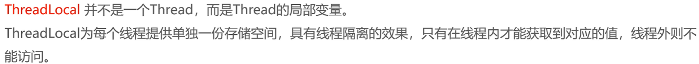

苍穹外卖项目实战笔记

# Day01

该项目用到了以下的技术：


该项目因此需要两个前端和一个后端：


代码结构为：


其中，pojo子项目中的分类为：


## Nginx

nginx可以作为一个反向代理，对前端发送的动态请求转发到后端服务器。具有以下优点：

> 提高访问速度；
>
> 实现负载均衡；
>

### 反向代理


### 负载均衡

负载均衡的实现是可能基于以下策略的：


## 完善登录功能

将密码的部分增加了一个md5加密的过程：

> ```
> password = DigestUtils.md5DigestAsHex(password.getBytes());
> ```

## 接口设计


所以在yapi中加入了管理端和验证端的接口信息。

## Swagger-后端接口测试技术


### API常用注解


通过接口注解，在接口文档就自动生成了对应的注解内容。

# Day02

## 员工管理

### 对象属性拷贝

```java
// 实用Spring带的对象属性拷贝
BeanUtils.copyProperties(employeeDTO, employee);
```

使用该方法将对象的属性方便地全部拷贝过去，但要求属性名得是一致的。

### 利用JWT令牌获得当前登录员工ID

JWT的过程如下图所示：


为了获得当前登陆的员工ID，就需要利用JWT令牌，从token中将ID解析出来。

### ThreadLocal技术

解析很好解析，但如何将解析出来的ID传递给其他方法用呢？这就涉及到了**ThreadLocal**。而可以使用的原因是：**客户端的每次请求都是一个单独的线程**。



### PageHelper一个分页查询小插件

可以通过PageHelper来辅助将结果分页查询：

```java
PageHelper.startPage(employeePageQueryDTO.getPage(), employeePageQueryDTO.getPageSize());
```

