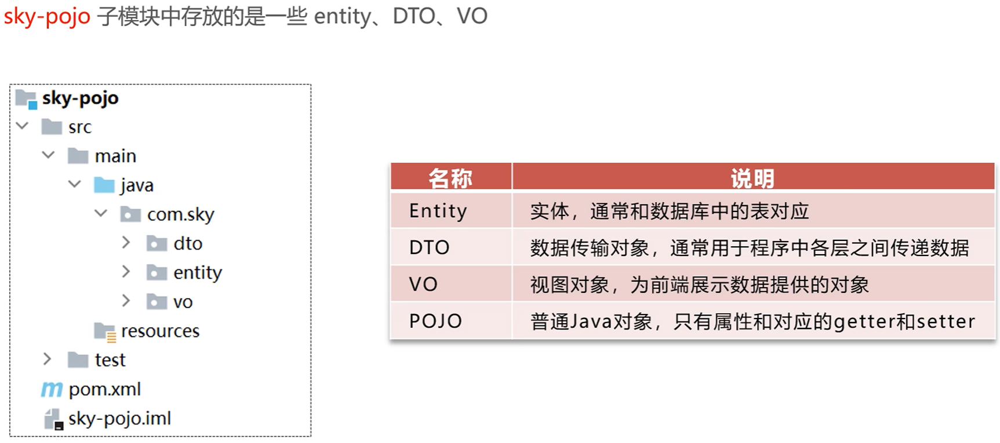

苍穹外卖项目实战笔记

# Day01

该项目用到了以下的技术：


该项目因此需要两个前端和一个后端：


代码结构为：


其中，pojo子项目中的分类为：



## Nginx

nginx可以作为一个反向代理，对前端发送的动态请求转发到后端服务器。具有以下优点：

> 提高访问速度；
>
> 实现负载均衡；
>

### 反向代理


### 负载均衡

负载均衡的实现是可能基于以下策略的：


## 完善登录功能

将密码的部分增加了一个md5加密的过程：

> ```
> password = DigestUtils.md5DigestAsHex(password.getBytes());
> ```

## 接口设计


所以在yapi中加入了管理端和验证端的接口信息。

## Swagger-后端接口测试技术


### API常用注解


通过接口注解，在接口文档就自动生成了对应的注解内容。

# Day02

## 员工管理

### 对象属性拷贝

经常用于DTO类型的数据属性传给原类型的过程。

```java
// 实用Spring带的对象属性拷贝
BeanUtils.copyProperties(employeeDTO, employee);
```

使用该方法将对象的属性方便地全部拷贝过去，但要求属性名得是一致的。

### 利用JWT令牌获得当前登录员工ID

JWT的过程如下图所示：


为了获得当前登陆的员工ID，就需要利用JWT令牌，从token中将ID解析出来。

### ThreadLocal技术

解析很好解析，但如何将解析出来的ID传递给其他方法用呢？这就涉及到了**ThreadLocal**。而可以使用的原因是：**客户端的每次请求都是一个单独的线程**。


### PageHelper一个分页查询小插件

可以通过PageHelper来辅助将结果分页查询：

```java
PageHelper.startPage(employeePageQueryDTO.getPage(), employeePageQueryDTO.getPageSize());
```

### JWT令牌的有效期

因为在员工登陆时设置了令牌，同时在server的applicationa文件中对令牌设置了有效期。

```yml
sky:
  jwt:

    admin-secret-key: itcast

    admin-ttl: 7200000

    admin-token-name: token
```

因此，如果长时间不操作，就得重新登录获取令牌。Swagger测试代码时在“**全局参数设置**”中替换为新的令牌。

### 处理日期格式

两种方式对日期处理，前者要一个个设置，后者可以一劳永逸。


#### 方式一

```java
@JsonFormat(pattern = "yyyy-MM-dd HH:mm:ss")
private LocalDateTime createTime;

@JsonFormat(pattern = "yyyy-MM-dd HH:mm:ss")
private LocalDateTime updateTime;
```

#### 方式二

```java
/*
扩展SpringMVC框架的消息转换器
 */
protected void extendMessageConverters(List<HttpMessageConverter<?>> converters){
    // 创建一个消息转换器对象
    MappingJackson2HttpMessageConverter converter = new MappingJackson2HttpMessageConverter();
    // 为消息转换器设置一个对象转换器,将java对象序列化为json数据,用于序列化和反序列化
    converter.setObjectMapper(new JacksonObjectMapper());
    // 将消息转换器添加到容器中
    converters.add(0,converter);
}
```

### 创建对象的Builder

如果类上有注解**@Builder**，则可以使用构造器构造对象，如下代码：

```java
//使用builder器创建对象
Employee.builder().status(status).id(id).build();
```

# Day03

## 公共字段自动填充

**公共字段**有以下几种，每次操作一般都需要对这些字段赋值的，就会产生很多冗余代码，后期维护不易变更。


### 实现思路


这样的话，只需要在想要操作的方法上加上这个注解就可以了。

## 新增菜品

一个新增菜品的功能包含三个接口，而查询菜品是已有的接口。

### 文件上传

这部分需要用到阿里云的OSS服务，首先要在配置文件中进行如下配置，在dev/普通环境中使用不同的配置文件：


### 菜品口味接口

需要设计一个DishFlavorMapper类，在新增菜品时对菜品的口味进行操作。

## 菜品分页查询


## 删除菜品

只用设计一个批量删除的接口，单个删除就是批量删除的特殊形式。但是如果用for循环包围，一次次执行单个删除操作，会产生较多次数的与数据库交互，这对性能的影响比较严重，可以通过优化SQL语句，一次交互达成多个效果：

```java
//        // 删除菜品表中的菜品数据
//        for(Long id : ids){
//            dishMapper.deleteById(id);
//            // 删除菜品关联的口味数据
//            dishFlavorMapper.deleteByDishId(id);
//        }
        dishMapper.deleteByIds(ids);
        dishFlavorMapper.deleteByDishIds(ids);
```

## 修改菜品

修改时，前端界面需要**回显菜品**的信息，所以这部分需要两个接口：根据ID查询菜品、修改菜品。

### 根据ID查询菜品

主要是在实现类中按照如下方法进行。

```java
public DishVO getByIdWithFlavor(Long id) {
    //根据id查询菜品
    Dish dish = dishMapper.getById(id);

    //根据ID查询口味数据
    List<DishFlavor> flavors = dishFlavorMapper.getByDishId(id);

    //查询到的数据封装VO
    DishVO dishVO = new DishVO();
    BeanUtils.copyProperties(dish,dishVO);
    //再额外封装一下口味数据
    dishVO.setFlavors(flavors);

    return dishVO;
}
```

### 修改菜品

修改菜品的逻辑为：

```java
public void updateWithFlavor(DishDTO dishDTO) {
    Dish dish = new Dish();
    BeanUtils.copyProperties(dishDTO, dish);

    // 修改菜品表
    dishMapper.update(dish);
    // 修改关联的口味表，比较复杂，为了简单起见，可以先全部删除再新增。
    dishFlavorMapper.deleteByDishId(dishDTO.getId());
    //重新插入口味数据
    List<DishFlavor> flavors = dishDTO.getFlavors();
    if(flavors != null && flavors.size() > 0){  //口味是可能为空的
        //先为这些口味表插入dishId
        for (DishFlavor flavor : flavors) {
            flavor.setDishId(dishDTO.getId());
        }
        dishFlavorMapper.insertBatch(flavors);
    }
}
```

# Day04

## 实战项目

# Day05

## Redis-另一种数据库


### 入门

解压压缩包后的redis即可使用，并可通过图形化界面redis manager使用。

### Redis中的数据类型


### 常用命令

#### 字符串操作


#### 哈希数据操作


#### 列表操作命令


#### 集合操作命令


#### 有序集合操作命令


#### 通用命令


## 在java中使用redis

本项目通过Spring Data Redis使用Redis，步骤为：


redis会默认生成16个DB数据库，默认使用0号数据库，当然也可以在yml里更改。

## 店铺营业状态设置

营业状态是一个布尔值，不必要另创建一张MySQL表，因此可以使用Redis存储状态。

# Day06微信小程序开发

## HttpClient

以POST请求为例，使用HttpClient：

```java
//POST请求
@Test
public void testPost() throws Exception {

    // 创建Httpclient对象
    CloseableHttpClient httpClient = HttpClients.createDefault();

    // 创建请求对象
    HttpPost httpPost = new HttpPost("http://localhost:8080/admin/employee/login");
    JSONObject jsonObject = new JSONObject();
    jsonObject.put("username","admin");
    jsonObject.put("password","123456");
    StringEntity entity = new StringEntity(jsonObject.toString());
    //指定请求编码方式
    entity.setContentEncoding("utf-8");
    //数据格式
    entity.setContentType("application/json");
    httpPost.setEntity(entity);

    //发送请求
    CloseableHttpResponse response = httpClient.execute(httpPost);

    //解析返回结果
    //获取返回状态码
    int statusCode = response.getStatusLine().getStatusCode();
    System.out.println("返回的状态码为"+statusCode);
    //获取返回内容
    HttpEntity entity1 = response.getEntity();
    String body = EntityUtils.toString(entity1);
    System.out.println("返回的数据体为"+body);
    //关闭资源
    response.close();
    httpClient.close();
}
```

## 小程序开发

### 前期准备

在微信小程序网页上注册，报备，然后下载小程序的开发工具。

### 目录结构


#### 页面文件


开发小程序不是重点，所以直接导入已有的文件就可以。

## 微信登录接口开发

为了完成微信登录功能的接口开发，首先需要在配置文件中添加新的配置：


## 商品浏览功能添加


